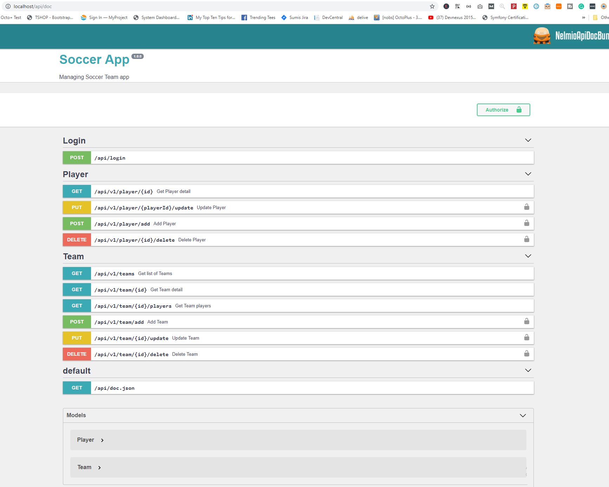

# Soccer App
> Manage Team & its players

## API Doc Screenshot


## Installation

Linux:

```sh
$ sudo docker-compose build
```

```sh
$ sudo docker-compose up -d
```

## Composer update

Enter inside the docker container

```sh
$ composer update
```

## Database Migration

Run migration script

```sh
$ bin/console doctrine:migrations:migrate
```


Run Data fixtures 

```sh
$ bin/console doctrine:fixtures:load
```
2 Users will be added

1. admin / secret - ROLE_ADMIN
2. user / secret - ROLE_USER

## Authentication

Used JWT Authentication, configured it ROLE based.

## Generate the SSH keys for JWT:

```sh
$ mkdir -p config/jwt
$ openssl genpkey -out config/jwt/private.pem -aes256 -algorithm rsa -pkeyopt rsa_keygen_bits:4096
$ openssl pkey -in config/jwt/private.pem -out config/jwt/public.pem -pubout
```

## Configure JWT pass_phrase:

Configure the SSH keys path in your config/packages/lexik_jwt_authentication.yaml :
``` yaml
lexik_jwt_authentication:
    pass_phrase:      'your_secret_passphrase' 
```


You are ready!!!

Go to <http://localhost/api/doc> to view all API's list


